layout: true

ANLY 503, Scientific and Analytical Visualization

---

## Graph 1
.left-column70[
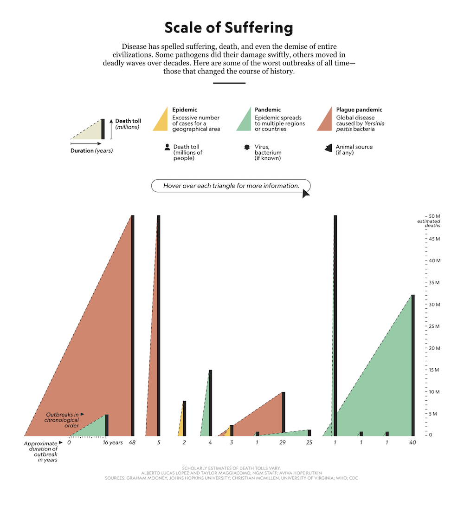
]
.right-column30[
Visualizing suffering over the ages

[National Geographic](https://www.nationalgeographic.com/magazine/2020/08/how-devastating-pandemics-change-us-feature/) [dynamic graph]
]

---

## Graph 2

.left-column70[
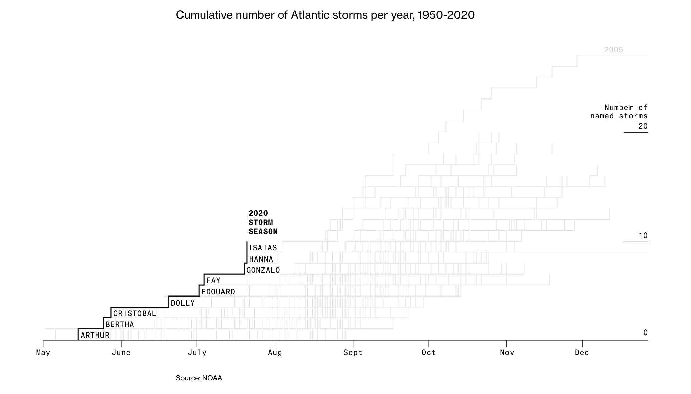
]
.right-column30[
Severity of the Atlantic storm seasons, 1950-2020

[Bloomberg](https://www.bloomberg.com/graphics/2020-hurricanes/)

]

---

## Graph 3

.left-column70[
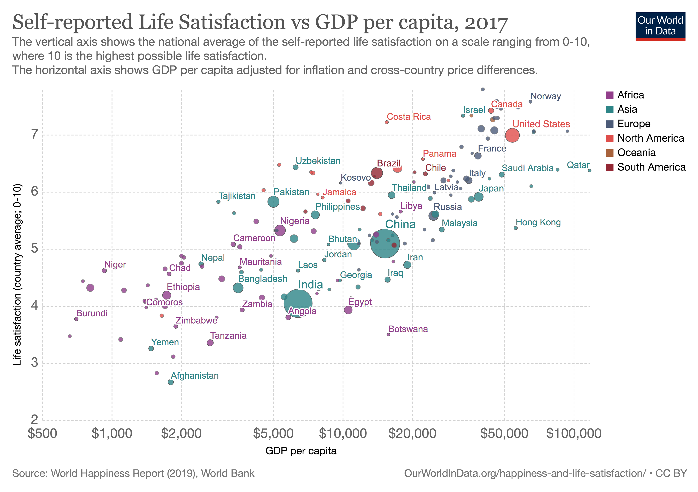
]
.right-column30[
Self-reported life satisfaction vs GDP

Data @ [World Bank](http://data.worldbank.org/data-catalog/world-development-indicators)

More information [here](https://ourworldindata.org/grapher/gdp-vs-happiness)

Just consider the static image and not the animation!!    
]

---

## Graph 4

.left-column70[
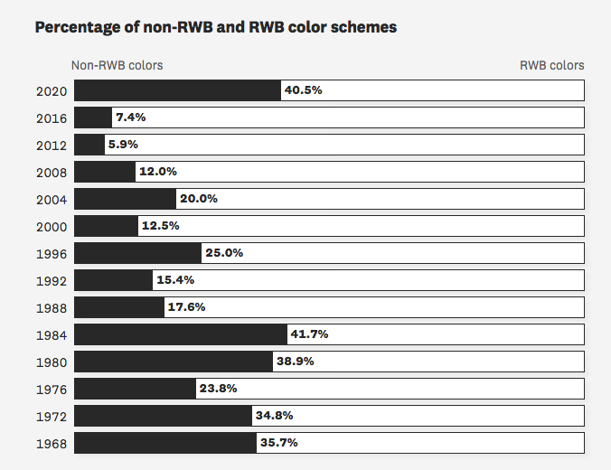
]
.right-column30[
Percentage of political candidates in United States using non-RWB (red, white, blue) colors in their campaigns by election year

Source: [Pudding](https://pudding.cool/2020/08/campaign-colors/)

]

---

## Graph 5

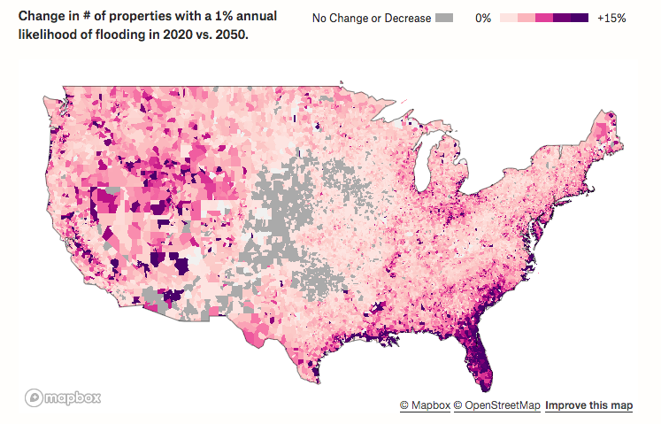
.footnote[
Source: [Pudding](https://pudding.cool/projects/flooding/visuals/)
]

---

## Graph 6

.left-column70[
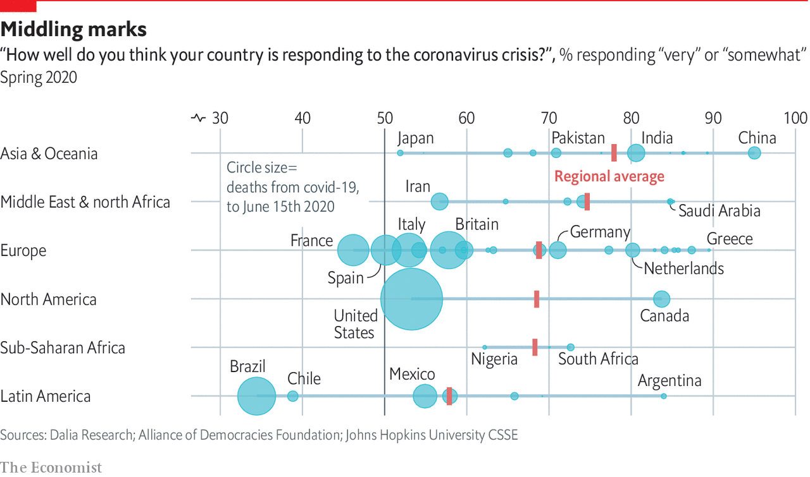
]
.right-column30[
Source: [The Economist](https://www.economist.com/graphic-detail/2020/06/17/much-of-the-world-thinks-the-response-to-the-pandemic-has-been-poor)
]

---

## Graph 7

.left-column70[
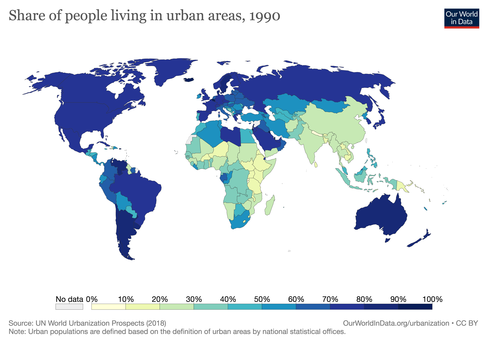
]
.right-column30[

]

---

## Graph 8

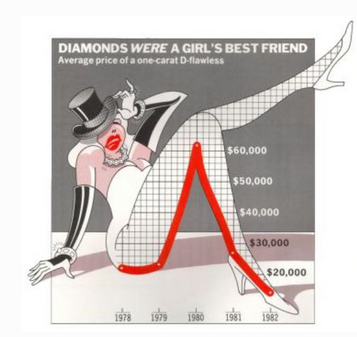

---

## Graph 9

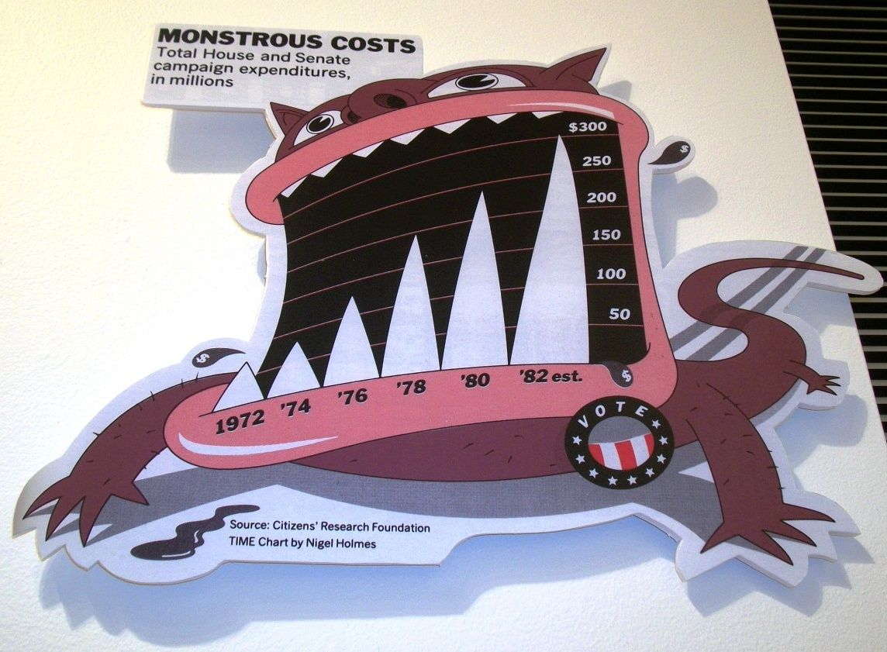

---

## Graph 10

.middle[
.center[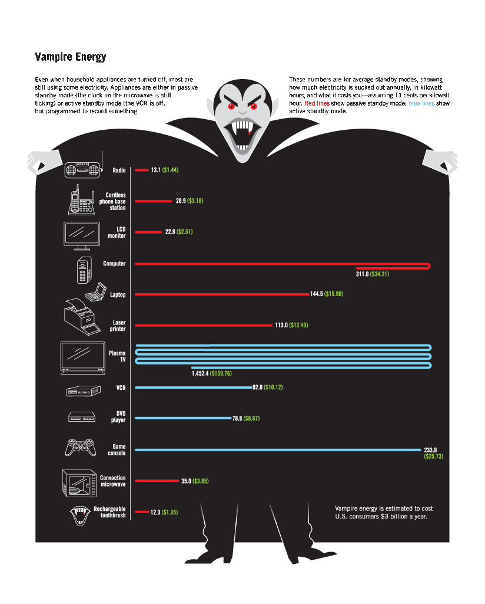]
]
.footnote[Source: [@ Nigel Holmes](http://www.nigelholmes.com/site/wp-content/uploads/2016/09/vampire_energy.png)
]

---

## Graph 11

.center[
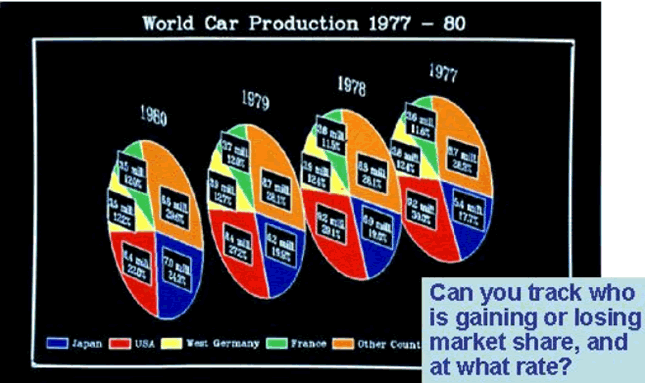
]

---

## Graph 12

.center[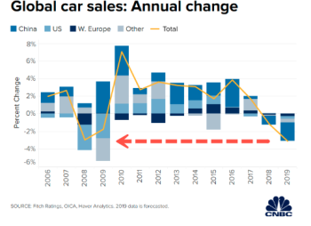]
.footnote[Source: [CNBC](https://www.cnbc.com/2019/11/25/global-car-sales-expected-to-slide-by-3point1-million-this-year-in-biggest-drop-since-recession.html)]

---

## Graph 13

.pull-left[
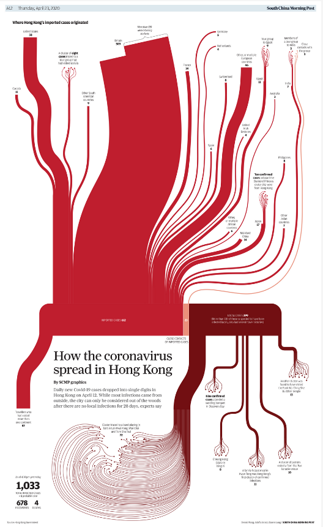
]
.pull-right[
See the full-size version
[here](https://multimedia.scmp.com/culture/article/SCMP-printed-graphics-memory/lonelyGraphics/202004A256.html)

Source: South China Morning Post
]

---

## Graph 14

.pull-left[
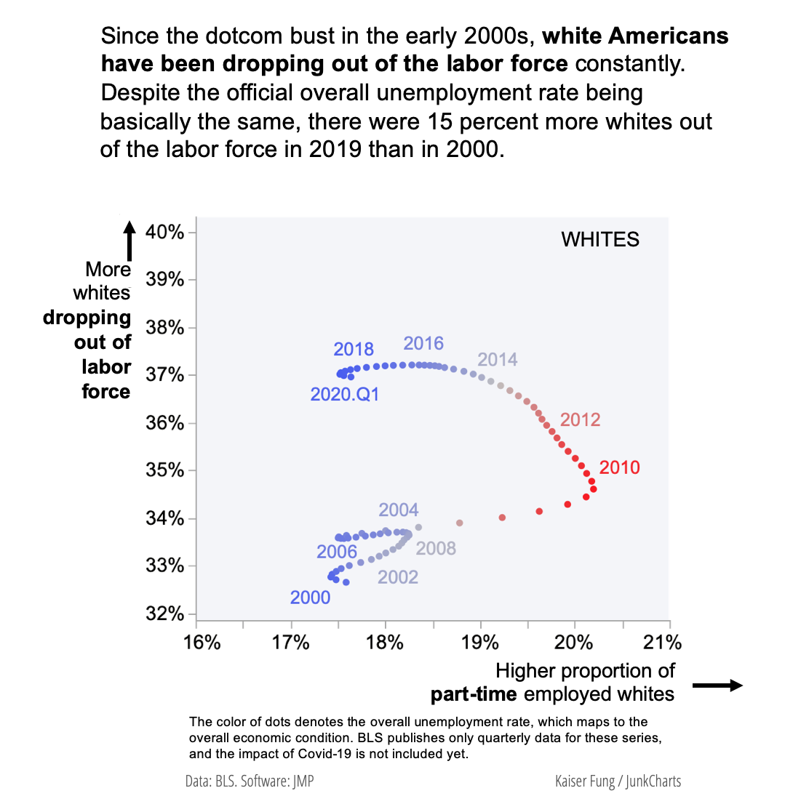
]
.pull-right[
The original article is [here](https://junkcharts.typepad.com/junk_charts/2020/06/visualizing-black-unemployment-in-the-us.html)
]

---

## Graph 15

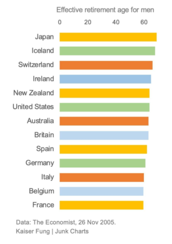

---

## Graph 16

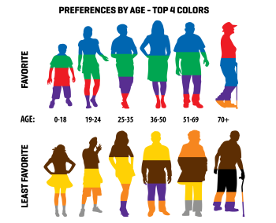
